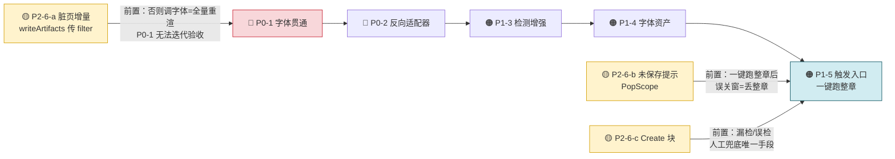

# P9.0 · S9（检测 / OCR / 翻译 / 嵌字自动化）开工前盘点

> 日期：2026-10-07（基于 P8.1 第三轮实机验收通过后）  
> 上游：`P6-翻译工作室-可行性与实施计划-20261005.md` §S9（792–808 行，目标与验收）、`P8.1-工作日志-S8可编辑画布.md`（S8 遗留）、`P8.0-翻译工作室修复与S8开工.md`（S8 五项与未做项）  
> 状态：**仅做盘点，未改代码**。结论用于决定 S9 的开工顺序与硬阻塞。  
> ⚠️ **2026-10-07 修订**：应用户要求复核「先做 🟡 P2-6（S8 残留），再做 🔴P0-1 → 🟠P1-5」这一顺序。复核结论见 **§七 开工顺序可行性复核**，速览表与 §六 已按复核结论改写。**结论：顺序成立，且 P2-6 里的「脏页增量」是 P0-1 的硬前置**（§七.2），但需加时间盒与三条修正（§七.4）。
>
> ✅ **2026-10-07 进度：第 0 批 🟡 P2-6 已全部完成** —— a 脏页增量（P9.1）· b 未保存提示（P9.2）· c Create 块（P9.3）。
> 🔴 **三个隐藏前置已全部落地**：① 命令模型加 `pageKey`（P9.1）② `TextBlock.createDefault` 唯一默认块模板（P9.3，**P0-2 的 `fromOcr` 必须复用它**）。
> ✅ **S9 验证载体已建**：`ComicLibrary/projects/S9Fixture`（5 页 / 852 KB / **带原图**，块为空）→ P1-3 气泡聚块、P0-2、P1-5 均可验证。说明见该目录 `README.md`。
> 🔴 **新增登记的坑**：本仓库有自己的 `IntRect`（`image_translation/translation_types.dart`），**不是 `dart:ui` 的** —— 见 P9.3 §四。
> **下一步：第 1 批 🔴 P0-1 字体贯通 → P0-2 反向适配器。**

---

## 〇、结论速览（S9 开工前必处理）

| 项                                      | 级别        | 一句话                                                                                                                                     | 不在 S9 里做会怎样                                     |
| -------------------------------------- | --------- | --------------------------------------------------------------------------------------------------------------------------------------- | ----------------------------------------------- |
| 1. 渲染链路字体属性全丢                          | 🔴 P0 硬阻塞 | `TextBlock.toTranslatedRegion()` + `result_renderer` 只传 rect/text/bg/fg/lineHeight，FontFormat 32 键全弃；`page_renderer` 写死 w500/height 1.2 | S9 即使能嵌字，用户改的字体/字号/描边/竖排/字距/旋转/透明度**成品里一个都不生效** |
| 2. 缺 `OCR → TextBlock` 反向适配器           | 🔴 P0 硬阻塞 | 现有只有 `TextBlock.toTranslatedRegion()` 单向桥，没有"检测结果新建块"                                                                                   | S9 自动管线跑出来无处落地，工作室拿不到可编辑块                       |
| 3. 检测只到文本行级，无气泡聚块+阅读顺序                 | 🟠 P1     | 现有 `text_detector` = PP-OCRv4 det（文本行），输出 `OcrBlock`（每行一个），**无气球框、无右起/分栏顺序**                                                            | S9「气泡级聚块」交付物缺口；漏检/误检与顺序错是 S9 验收第一条              |
| 4. 字体资产未进工程                            | 🟠 P1     | `pubspec.yaml:153` 的 `fonts:` 被注释；`assets/fonts/` 不存在；现渲染回退系统字体（雅黑）                                                                     | 「中文字体不依赖系统字体」验收过不了；发行版缺字体即乱码                    |
| 5. 工作室无检测/OCR/翻译触发入口                   | 🟠 P1     | `studio_page.dart` 只有属性面板，无"运行自动管线"按钮/菜单                                                                                                | S9 闭环（跑→看→人工兜底）缺触发点                             |
| 6. S8 残留（Create 块 / 未保存提示 / result 增量） | 🟡 P2     | Create 块未做、PopScope 未接、`result/` 全量重渲染                                                                                                  | S9 自动嵌字频繁触发保存/重渲染，若无脏页增量与未保存提示，体验崩              |
| 7. 测试素材现状                              | 🟢 信息     | `Error the Echo` 原图已删；`My Dragon Girlfriend Has Returned` 原图完整（上轮已修缺页+登记）                                                               | S9 端到端验证载体已确定，但开工前需先 `page-reconcile` 确保 0 空洞   |
| 8. 验证通道                                | 🟢 就绪     | `tools/run_headless_task.py` 已修好（GUI 子系统吞 stdout 问题）                                                                                    | headless 可验证"能跑通/块数合理/无崩溃"，视觉仍需实机               |

**建议开工顺序（2026-10-07 复核后已修订）**：

> **第 0 批 🟡 P2-6（S8 残留）→ 第 1 批 🔴 P0（1+2）→ 第 2 批 🟠 P1（3+4+5）**
>
> 理由不是"P2-6 更简单"，而是两条实证依赖（§七.2）：
>
> - **P2-6 里的「`result/` 脏页增量」是 P0-1 的硬前置** —— 字体贯通后每调一次字号就要重渲全工程（当前 `writeArtifacts` 无 `filter` 调用点，靠 `_regenerateResults()` 全量跑）；没有增量，P0-1 只能靠"改字号→重渲 97 页→肉眼找差异"来验收，迭代成本高到不可用。
> - **P2-6 的「Create 块 + 未保存提示」是 P1-5 的硬前置** —— S9 整章一键跑完会产生**几十个新块 + 一次大保存**；没有 Create 兜底、没有离开拦截，误操作丢的是整章工作量。
>
> 代价与修正见 §七.4（**必须给 P2-6 设时间盒**，否则它会吃掉 S9 的启动预算）。

---

## 一、S9 目标复述（取自 P6 §792）

> **目标**：一键"检测 → OCR → 翻译 → 嵌字"整章跑通，人工只需兜底。  
> **交付**：
>
> - 检测：在现有 DBNet 上加**气泡级聚块**（用 FT 的 `group_output` 思路重写）+ **阅读顺序**（右起 / 分栏）
> - OCR：接入更多语言（韩/英），竖排走 manga-ocr
> - 渲染增强：**字体资产**（中文/日文字体进 `assets/`）+ `letter_spacing` + 描边宽度
> - 批量任务接进 `PreTranslationTaskManager`（复用暂停/恢复/断点续跑）  
>   **验收**：① 一键跑一章，检测框与 FT 对比漏检/误检可接受；② 阅读顺序正确（右起不乱序）；③ 中文字体不依赖系统字体；④ 任务可暂停/恢复/取消、断点续跑。

---

## 二、现有管线能力盘点（能做什么 / 缺什么）

**已具备（S5–S8 沉淀，S9 可直接复用）**：

- **OCR**：`text_detector`（PP-OCRv4 det）已落地；`ocr_ja`（manga-ocr，竖排）、`ocr_zh/en/ko`（PP-OCRv4 rec）模型注册齐全（`translation_models.dart`）。`TranslationWorker` 异步隔离、`OrtFfi` 同步绑定 ONNX Runtime 已可用。
- **翻译**：`TranslationDispatcher` 支持 LLM（在线）+ 离线 NLLB/Opus-MT（ONNX），`translation_pipeline.dart` 已能 `analyzePage` / `ocrPage`。
- **去字/嵌字渲染**：`page_renderer.dart`（`renderTranslatedPage`）+ `inpaint.dart`（纯 Dart 智能擦除 + 描边）；`InpaintMode.smart/patch`。
- **批量框架**：`PreTranslationTaskManager`（`pre_translation_tasks.dart:297`）已支持暂停/恢复/断点续跑/任务列表——S9 的"整章批量"可接入，但**产物写向不同**（见 §五）。
- **工程模型**：`TextBlock`（23 键）+ `FontFormat`（32 键）已在 S6 完整实现（`text_block.dart`），面板能编辑字体/字号/字距/竖排/旋转/透明度，但**渲染不用它们**（见 P0）。
- **工作室画布**：S8 的可编辑画布、撤销/重做、条带长画布、属性面板、保存契约已全部就绪。

**缺失（S9 必须新建/补完）**：见 §三。

---

## 三、S9 开工前必须处理的问题（分级）

### 🔴 P0-1 · 渲染链路字体属性全丢（硬阻塞）

**代码位置**：

- `lib/foundation/translation_project/text_block.dart:607-639` `toTranslatedRegion()`：只取 `format.raw['frgb']/['srgb']` 算颜色，其余 `FontFormat` 字段**一个不传**。
- `lib/foundation/translation_project/result_renderer.dart:41-56`：把 `TextBlock` 拍平为 `TranslatedRegion` 时只带 `rect/text/bg/fg/lineHeight`。
- `lib/foundation/image_translation/page_renderer.dart:248-264`：`_fillStyle`/`_strokeStyle` **写死** `fontWeight: FontWeight.w500`、`height: 1.2`，字号只用 OCR 的 `lineHeight` 推断。

**后果**：这就是 S8 五项②（P8.1 §144、P8.0 §5.2 第 3 项）。用户在工作室面板改的字体/字号/字重/字距/行距/竖排/旋转/透明度，**保存后成品位图一个都不体现**——渲染器根本没收到这些字段。

**S9 必须做**：

1. 扩展 `TranslatedRegion` + `renderTranslatedPage` 接收 `fontFamily / fontSizeScale / fontWeight / letterSpacing / lineSpacing / vertical / rotation / opacity / strokeWidth` 等；或让渲染器直接吃 `TextBlock`（推荐后者，避免两处字段同步）。
2. `text_block.dart` 的 `toTranslatedRegion()` 与 `result_renderer.dart` 同步带上全部 `FontFormat`。
3. `page_renderer.dart` 移除写死的 w500/1.2，改读传入样式。

### 🔴 P0-2 · 缺 `OCR → TextBlock` 反向适配器（核心接缝）

**现状**：全仓检索 `OcrBlock / TranslatedRegion → TextBlock` 的适配器——**不存在**。只有 `TextBlock.toTranslatedRegion()`（单向）。

**后果**：S9 自动管线产出的是 `OcrBlock`/`TranslatedRegion`（扁平、含 OCR 推断的 lineHeight/颜色/语言），而工作室工程模型是 `TextBlock`（含 `FontFormat` 32 键）。没有反向桥，S9 跑完检测+OCR+翻译，**生成的块无处落成可编辑的工程块**。

**S9 必须做**：新建 `TextBlock.fromOcr(...)` / `fromRegion(...)`：

- 用 OCR 结果初始化 `xyxy`、`translation`、`_detected_font_size`、`src_is_vertical`（竖排由 OCR/manga-ocr 判定或几何推断）、`frgb/srgb`（取 OCR 检测到的原文颜色）、`fontFormat`（首次建块按 OCR 结果填 `font_size`、`vertical` 等默认值）。
- 定义"已有块 vs 新检测块"的合并策略：自动管线跑完是**整页覆盖**还是**追加+人工核对**（P10 跨页缝合依赖人工核对，建议默认覆盖并按 `block id` 稳定对齐，便于 S9 后再编辑）。

### 🟠 P1-3 · 检测只到文本行级，缺气泡聚块 + 阅读顺序

**现状**：`text_detector`（PP-OCRv4 det）输出**文本行**级 `OcrBlock`，没有任何"气泡（balloon）"聚合，也没有阅读顺序（右起 / 分栏）。FT 的 `group_output` + 阅读顺序在 VeneraX 侧**完全没有对应实现**。

**S9 必须做（算法工作量，P6 风险表已预警"被低估→S9 延期"）**：

- **方案 A（纯几何，无新模型）**：文本行按位置/间距聚类成气泡框 + 版面分析定阅读顺序（右起漫画按右→左、上→下；分栏按列）。实现快、无需下载新模型，但质量不如 FT 的气球检测。
- **方案 B（引入 comic-text-detector 气球检测模型）**：精度高，但要新增一个 ONNX 模型组件（下载/注册/worker 加载），工作量与 P0-1 同量级。
- 建议 S9 先交付**方案 A** 打通闭环，气球检测作为精度增强选项后置。

### 🟠 P1-4 · 字体资产未进工程

**现状**：`pubspec.yaml:153` 的 `fonts:` 整段被注释；`assets/fonts/` 目录不存在；当前渲染回退系统字体（面板默认 `Microsoft YaHei UI`）。

**后果**：S9 验收③「中文字体不依赖系统字体」不可能通过；发行版/非 Windows 平台缺字体即乱码或回退异常。

**S9 必须做**：打包开源中文字体（如 Noto Sans CJK / 思源黑体子集，注意 LICENSE 内嵌声明）+ 日文（若需），注册到 pubspec `fonts:`，渲染器按 `fontFamily` 加载；面板字族选择器（S8 遗留⑤）随字体资产一起上。

### 🟠 P1-5 · 工作室无检测/OCR/翻译触发入口

**现状**：`studio_page.dart` 仅含属性面板与画布，**无任何"运行自动管线"的按钮/菜单**；全仓检索 `analyzePage/ocrPage/PreTranslation` 在 `pages/translation_studio/` 下**零命中**。

**S9 必须做**：新增"单页运行 / 整章批量运行 / 停止 / 结果预览 / 人工兜底编辑"闭环。进度/取消/断点续跑可复用 `PreTranslationTaskManager`，但**关键差异**：旧引擎把产物写进**阅读器 OCR 缓存**，S9 必须把产物写进**工作室工程（新建/更新 `TextBlock`）**——这是与旧 AI 翻译引擎的本质分叉，不能在旧路径上糊。

### 🟡 P2-6 · S8 残留（复核后**提升为第 0 批**，见 §七）· ✅ **已全部完成**

| 项                   | 落地轮次                                                                                                   | 结果                                                                          | 与 S9 的依赖关系                                 |
| ------------------- | ------------------------------------------------------------------------------------------------------ | ----------------------------------------------------------------------------- | ------------------------------------------ |
| **`result/` 脏页增量** | **P9.1**                                                                                                | `EditHistory.dirtyPages` 重算式；实测 `full=97 vs dirty=1`                  | 🔴 **P0-1 的硬前置**：字体贯通后每次调字号都触发全量重渲         |
| **未保存提示**           | **P9.2**                                                                                                | 新增 `leave_guard.dart`；覆盖 5 条离开路径中的 4 条（Alt+F4 缺口已登记）        | 🔴 **P1-5 的硬前置**：一键跑整章后误关窗 = 丢整章           |
| **Create 块**           | **P9.3**                                                                                                | `TextBlock.createDefault`（23 键）+ `FontFormat.createDefault`（32 键）+ AppBar 按钮 | 🔴 **P1-5 的硬前置**：整章跑完漏检/误检时，人工"补块"是唯一兜底 |

> 📌 **原盘点对这三项的成本估计偏低**。实际各有一处"隐藏前置"不在盘点里：`dirtyPages` 需要命令模型携带 `pageKey`（P9.1）；`PopScope` **拦不住** `popUntil` 与 `exit(0)`，需自建 `LeaveGuardRegistry`（P9.2）；Create 块需要先落**唯一默认块模板**（P9.3，供 P0-2 复用）。

---

## 四、测试工程 / 素材现状（S9 验证载体）· ✅ **载体已建**

- ✅ **`S9Fixture`**（P9.3 建，见 `ComicLibrary/projects/S9Fixture/README.md`）：`downloads/My Dragon Girlfriend Has Returned/1 [Asura Scans]/1–5.webp` **复制**出 5 页（900×1778，852 KB），`projects/S9Fixture/` 下独立成工程（`bt_6c25fb2a`），**带原图**、块为空。`edit-check` 已支持在空工程上自举（45/45 PASS）。**P0-2 / P1-3 / P1-5 均可用它验证。**
  - 🔴 两条硬约束：**不要移动/改名 `imgtrans_S9Fixture.json`**（`bt_` 卡 id ＝ json 路径 FNV 哈希，改路径换 id → 历史变孤儿）；**不要塞进 `downloads/`**（扫描器红线：章节目录内有子目录 → 整本被拒）。
  - 🔴 **用 Python 生成/手改载体 JSON 必须传 `separators=(', ', ': ')`** —— `PyJson` 是 Python `json.dumps` 的默认紧凑格式，`indent=4` 会让 `roundtrip` 立刻失败。
- **`Error the Echo`**：FT 工程可用（85 块 / 97 页），但**原图已删**（S8 时即卡在此）→ 靠 `inpainted/` 兜底。**只能继续用于"不碰图像内容"的验证**（P9.1/P9.2 即如此）。
- **`My Dragon Girlfriend Has Returned`**：**原图完整**，1–7 话（Asura Scans）齐全，第 6 话另有 DivaScans 版本—— 仍是 S11「生肉→检测→OCR→嵌字」**端到端**验证的最佳候选（本载体只有 5 页，不足以做整章端到端）。
- ⚠️ **端到端验证前必做**：对整个漫画跑一次 `page-reconcile` 确认全部章节 0 空洞（尾部截断离线不可判，见 P6.7 §十七）。残缺页会让 S9 检测基于坏数据。

---

## 五、验证通道（已就绪）

- `tools/run_headless_task.py`（上一轮新增，包成一次性计划任务以绕开 GUI 子系统吞 stdout 的问题）——可用于 S9 的"检测能否跑通 / 块数是否合理 / 是否崩溃"非视觉验证。
- 但 **S9 的验收 ①②③（漏检/误检对比、阅读顺序、字体显示）是视觉验收**，headless 只能证"能跑"，视觉仍需你实机确认。


## 七、开工顺序可行性复核（2026-10-07 · 应用户提议）

### 7.1 提议与结论

- **提议**：先完成 🟡 P2-6（S8 残留），然后按 🔴 P0-1 → 🟠 P1-5 顺序推进。
- **结论**：✅ **顺序成立，予以采纳**。这不是"先做简单的"，而是 P2-6 与 P0/P1 之间存在**两条真实依赖**，原盘点把它们当"顺带收尾"是低估了。

### 7.2 两条依赖链（这是顺序成立的根本原因）



```

**依赖 1：P2-6-a → P0-1（工具链依赖）**
`studio_page.dart:503` 的 `_regenerateResults()` 调 `writeArtifacts` 时**没传 `filter`**，而 `writeArtifacts` 本身**支持**（`project_writer.dart:330`）。P0-1 完成后，"调一次字号 → 保存"是**最高频的动作**；若仍是全量重渲（Error the Echo = 97 页），每次调参都要等一整轮位图渲染，"所见即所得"根本没法用。**P0-1 是 S8 五项②的收口，必须能自证，而自证需要增量。**

**依赖 2：P2-6-b/c → P1-5（数据安全依赖）**
P1-5 交付的是"一键跑整章"，一次运行会**产生几十个新块 + 一次大保存**。此时：
- 没有 Create 块 → 漏检/误检**没有任何兜底手段**，用户只能删了重跑；
- 没有未保存提示 → 点错关闭 = 整章白跑。

S8 阶段这些代价只是"丢一次手动编辑"；S9 阶段是"丢一次整章自动管线"。**量级变了，前置关系就成立。**

### 7.3 反过来：不先做 P2-6 的风险（为什么不建议原顺序）

原顺序（P0/P1 先做、P2-6 顺带收尾）的问题**不在顺序本身，而在"P2-6 顺带做"这个假设**：

| 隐患 | 说明 |
|---|---|
| 🔴 **P0-1 会变成不可验收项** | 全量重渲下改字体属性，97 页重渲一轮才能看到差异，且容易把"字体没生效"误判为"渲染慢/缓存旧" |
| 🔴 **P1-5 上线即带数据丢失风险** | 整章一键跑 + 无离开拦截 = 用户一次误操作丢掉整章；而这恰是 S9 唯一的交付形态 |
| 🟠 **P1-4 与 P0-1 若被排开，会产生"假绿"** | P0-1 让渲染器认 `fontFamily`，但无注册字体 → 改字体族没反应。**验收必须显式声明字族未验收**，否则绿灯是假的 |

### 7.4 ⚠️ 三条必须附加的修正（否则第 0 批会失控）

采纳"第 0 批先做 P2-6"的风险是**它吃掉 S9 的启动预算**。因此必须：

1. **给第 0 批设时间盒**：建议**不超过 S9 启动预算的 1/4**。若 P2-6 三项做完已用掉 S9 首周的大半，说明它被低估了，应立即把 P1-3 的方案 A（几何聚块）后置，而不是压缩 P0。
2. **🔴 拆出一个"隐藏前置"，必须先做**：
   - `ProjectEditCommand` **不携带 `pageKey`**（`edit_command.dart:72-83`），`captureBlockEdit/captureBlockListEdit` 也不接收 → **"哪些页脏了"这个信息现在拿不到**。
   - 脏页增量必须先给命令模型**加 `pageKey` 字段**（`BlockEditCommand` / `BlockListEditCommand` / 两个 capture 辅助），再让 `EditHistory` 维护一个 `Set<String> dirtyPages`（`push` 时并入、`markSaved` 时清空、**undo/redo 要按命令方向增删** —— 注意：撤销回保存点时该页应从集合移除，否则会出现"撤销了却仍重渲"的假脏）。
   - 改动点集中在 `edit_command.dart`，**不碰 P0/P1 的任何文件** → 不制造返工。
3. **Create 块要顺带定下"默认块模板"的单一入口**：`TextBlock(this.raw)` 只有 raw 构造，S8 从没写过"空白块"。**P0-2 的 `fromOcr` 将来必须复用同一个模板工厂**，否则会出现"人工建的块"与"自动建的块"字段规格不一致（最典型：`translation` 空、`_detected_font_size` 缺失、`fontFormat` 键集不同），并在零字节 diff 上炸出来。建议 P2-6-c 先落一个 `TextBlock.createDefault(rect: ...)` 作为**唯一**默认块来源。

### 7.5 顺序变更后的风险登记

| 风险 | 触发条件 | 缓解 |
|---|---|---|
| 第 0 批膨胀，挤掉 S9 核心 | P2-6 三项加起来超过 1/4 预算 | 时间盒到点即停，把 P1-3 方案 A 后置；**绝不压缩 P0** |
| 命令模型加 `pageKey` 引入回归 | undo/redo 与 dirtyPages 不同步 | `edit-check`（现 17 项）必须扩到覆盖"改页→撤销→保存不重渲" |
| 脏页漏记导致成品与 JSON 不同步 | 有写入路径绕过 `_editBlock`（如未来 P0-2 批量建块、S9 管线直写） | **P2-6-a 就要把"脏页登记"收敛到一个入口**，并规定"任何写 `pages[key]` 的路径必须登记"；P0-2/P1-5 只能走这个入口 |
| 0 批做完仍看不出差别 | 增量带来的性能改善不直观 | 完成判据已定死为**可观测计数**（artifact 数=1），不要靠"感觉快了"验收 |

### 7.6 一句话总结

> 用户提议的顺序**在依赖关系上成立**（P2-6-a→P0-1 是工具链硬前置，P2-6-b/c→P1-5 是数据安全硬前置），
> 采纳为 **第 0 批 P2-6 → 第 1 批 P0 → 第 2 批 P1**；但必须**附加"命令模型加 pageKey"这个隐藏前置**，
> 并**给第 0 批设时间盒**，否则会出现"P2-6 吃掉启动预算"和"P0-1 变成不可验收项"两头受损。
```
